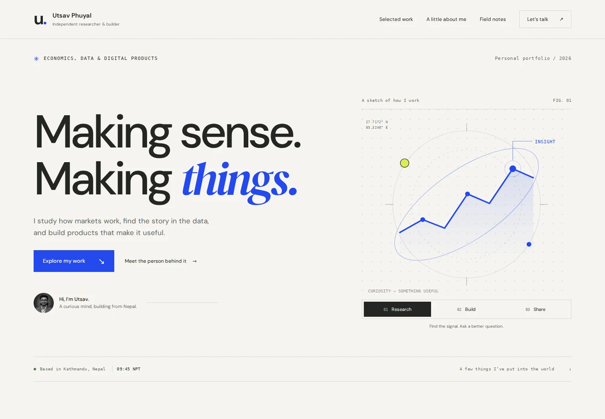
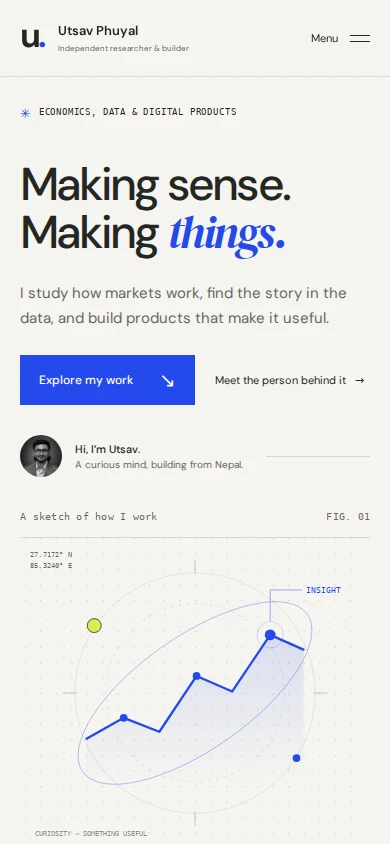

# Portfolio redesign verification

Verified with Chromium at desktop and phone sizes before opening the pull request.

## Responsive layout

No horizontal page or content overflow at **320, 360, 375, 390, 430, 640, 700, 701, 768, 820, 1024, 1280, 1440 and 1920 px** widths. Desktop and mobile screenshots were visually inspected.

## Browsing flow

- Research, Build and Share buttons update the illustration, selected state and caption.
- TradePulse website/dashboard buttons update the real product screenshot, destination and accessible label.
- Mobile menu opens, closes after following a link, closes on Escape and returns focus to the toggle. It resets after crossing the desktop breakpoint.
- Project story and field-note disclosures open and close.
- Copy-email control copies the correct address; a denied clipboard request displays a helpful fallback.
- All internal anchors resolve; portraits and both TradePulse previews load.
- Content, navigation and disclosures work with JavaScript disabled. JavaScript-only controls are hidden in this mode.
- Reduced-motion preference disables animated transitions and smooth scrolling.

## Automated accessibility and browser checks

Axe checks for WCAG 2 A/AA, WCAG 2.1 AA and best-practice tags reported **zero violations at 1440 and 390 px**. There were no JavaScript errors or failed local asset requests. JavaScript syntax and `git diff --check` passed. These automated checks supplement keyboard and visual review; they do not constitute a comprehensive accessibility audit.

## Deployment and external links

The custom domain file and search verification token are preserved. The site remains static and requires no package installation or build step. TradePulse website and dashboard previews were captured from the live products. Their links use `tradepulsenepal.com` and `app.tradepulsenepal.com`.

Verification covers the portfolio and its links, not the complete operation of third-party project applications. Browser checks used desktop Chromium with responsive viewport emulation; physical iPhone/Android and Safari testing was not performed.

## Previews

[Full desktop view](desktop-full.webp) · [Full mobile view](mobile-full.webp)
